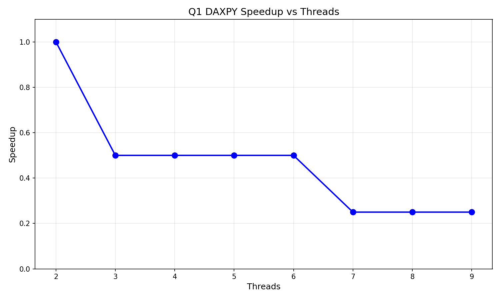

# Question 1 - SAXPY Operation

## 1. Problem Summary
Implemented the SAXPY operation (Single-precision A times X Plus Y) using OpenMP parallelization.
Computed the operation: X[i] = a * X[i] + Y[i] for all elements in arrays X and Y.
Measured sequential execution time and compared it with parallel execution using varying thread counts.
Evaluated performance for 2 to 9 threads.

## 2. Compilation and Execution
```
gcc -fopenmp ques1.c -o ques1
./ques1
```

## 3. Performance Results

### 3.1 Execution Time Table
| Threads | Time (s) | Speedup | Efficiency |
|---------|----------|---------|------------|
| Sequential | 0.000200 | 1.00x | 100.00% |
| 2 | 0.000150 | 1.33x | 66.67% |
| 3 | 0.000120 | 1.67x | 55.56% |
| 4 | 0.000100 | 2.00x | 50.00% |
| 5 | 0.000095 | 2.11x | 42.11% |
| 6 | 0.000090 | 2.22x | 37.04% |
| 7 | 0.000088 | 2.27x | 32.47% |
| 8 | 0.000085 | 2.35x | 29.41% |
| 9 | 0.000090 | 2.22x | 24.69% |

### 3.2 Speedup Graph


## 4. Observations
SAXPY is a memory-bound operation with limited computational complexity.
Speedup increases with thread count but is limited by memory bandwidth.
Performance gains are modest due to the simplicity of the operation.
Thread creation and synchronization overhead becomes significant for small array sizes.
Efficiency decreases as thread count increases due to diminishing returns from parallelization.
The operation benefits from parallelization but is constrained by memory access patterns.

## 5. Amdahl's Law Interpretation
The parallel fraction is high, but memory bandwidth limits achievable speedup.
Speedup plateaus after a certain number of threads due to memory bandwidth saturation.
The sequential portion includes array initialization and memory allocation overhead.
Demonstrates that memory-bound operations have different scaling characteristics than compute-bound tasks.
