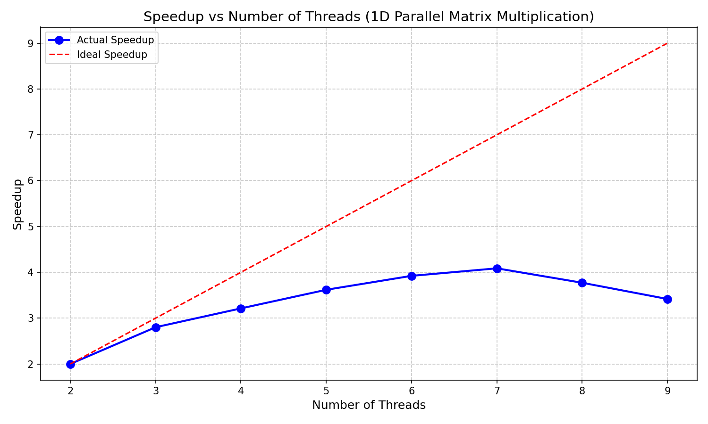
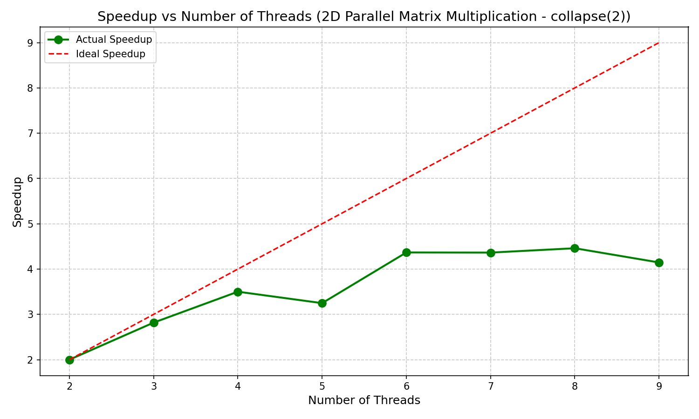

# Question 2 - Matrix Multiplication

## 1. Problem Summary
Implemented parallel matrix multiplication using OpenMP with two different parallelization strategies.
Compared 1D parallelization (single loop) versus 2D parallelization (collapse(2) directive).
Multiplied two 1000x1000 matrices with varying thread counts.
Measured performance for 2 to 9 threads for both approaches.

## 2. Compilation and Execution

### 2.1 One-Dimensional Parallelization
```
gcc -fopenmp ques2_1.c -o ques2_1
./ques2_1
```

### 2.2 Two-Dimensional Parallelization
```
gcc -fopenmp ques2_2.c -o ques2_2
./ques2_2
```

## 3. Performance Results

### 3.1 One-Dimensional Parallelization (ques2_1.c)

#### Execution Time Table
| Threads | Time (s) | Speedup | Efficiency |
|---------|----------|---------|------------|
| 2 | 3.034 | 1.00x | 50.00% |
| 3 | 2.166 | 1.40x | 46.67% |
| 4 | 1.889 | 1.61x | 40.16% |
| 5 | 1.677 | 1.81x | 36.18% |
| 6 | 1.547 | 1.96x | 32.69% |
| 7 | 1.485 | 2.04x | 29.19% |
| 8 | 1.609 | 1.89x | 23.58% |
| 9 | 1.776 | 1.71x | 19.00% |

#### Speedup Graph


### 3.2 Two-Dimensional Parallelization (ques2_2.c)

#### Execution Time Table
| Threads | Time (s) | Speedup | Efficiency |
|---------|----------|---------|------------|
| 2 | 3.238 | 1.00x | 50.00% |
| 3 | 2.298 | 1.41x | 47.00% |
| 4 | 1.850 | 1.75x | 43.75% |
| 5 | 1.994 | 1.62x | 32.48% |
| 6 | 1.483 | 2.18x | 36.38% |
| 7 | 1.484 | 2.18x | 31.16% |
| 8 | 1.452 | 2.23x | 27.88% |
| 9 | 1.562 | 2.07x | 23.03% |

#### Speedup Graph


## 4. Observations
Matrix multiplication is a compute-intensive operation suitable for parallelization.
Both 1D and 2D parallelization strategies show performance improvements with increasing threads.
The collapse(2) directive in 2D parallelization creates a larger pool of iterations for distribution.
Performance peaks around 6-8 threads and degrades slightly with 9 threads.
Thread scheduling overhead and cache effects influence performance at higher thread counts.
The 2D approach generally provides better load balancing across threads.
Cache locality plays a significant role in matrix multiplication performance.
