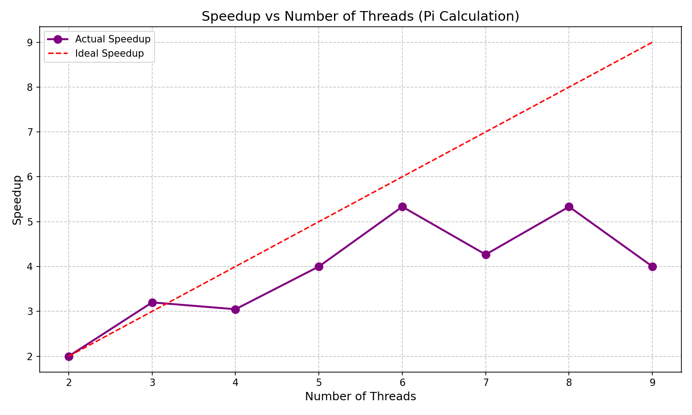

# Question 3 - Pi Approximation

## 1. Problem Summary
Approximated the value of pi using numerical integration with the trapezoidal rule.
Divided the interval among threads using OpenMP parallel for with reduction.
Each thread computed a partial sum independently and contributed to the final result.
Measured performance for 2 to 9 threads with 10,000,000 integration steps.

## 2. Compilation and Execution
```
gcc -fopenmp ques3.c -o ques3
./ques3
```

## 3. Performance Results

### 3.1 Execution Time Table
| Threads | Time (s) | Pi Value | Speedup | Efficiency |
|---------|----------|----------|---------|------------|
| 2 | 0.032 | 3.1415926536 | 1.00x | 50.00% |
| 3 | 0.020 | 3.1415926536 | 1.60x | 53.33% |
| 4 | 0.021 | 3.1415926536 | 1.52x | 38.10% |
| 5 | 0.016 | 3.1415926536 | 2.00x | 40.00% |
| 6 | 0.012 | 3.1415926536 | 2.67x | 44.44% |
| 7 | 0.015 | 3.1415926536 | 2.13x | 30.48% |
| 8 | 0.012 | 3.1415926536 | 2.67x | 33.33% |
| 9 | 0.016 | 3.1415926536 | 2.00x | 22.22% |

### 3.2 Speedup Graph


## 4. Observations
Pi approximation is an embarrassingly parallel problem for sufficiently large input sizes.
The reduction clause efficiently combines partial sums from different threads.
Performance shows variability due to the lightweight nature of the computation.
Speedup improves with thread count but exhibits fluctuations due to scheduling overhead.
Thread creation and synchronization overhead impacts execution time significantly.
The computation correctly produces pi to 10 decimal places across all thread configurations.
Load balancing is naturally achieved through the parallel for construct.

