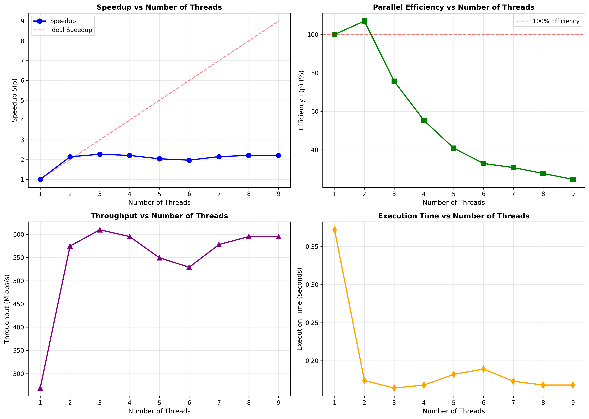
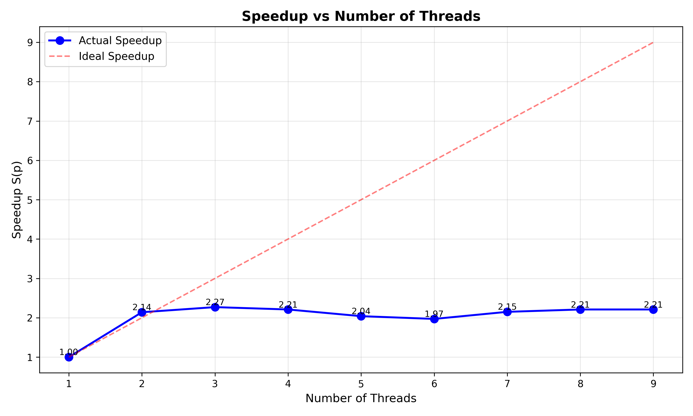
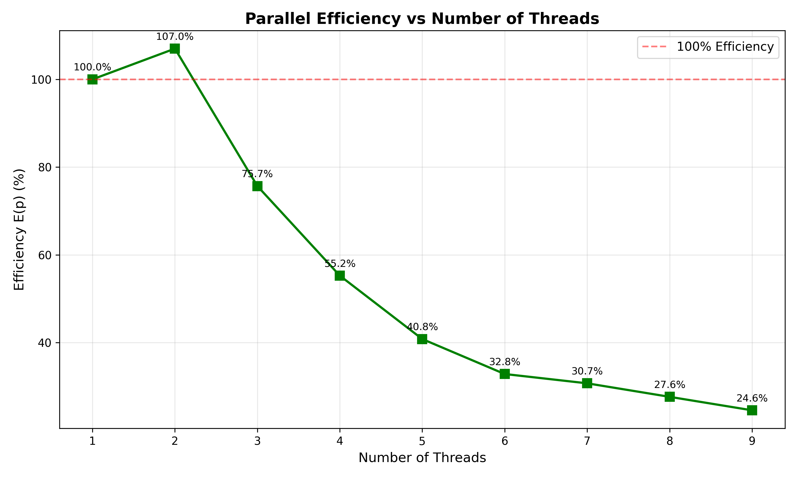
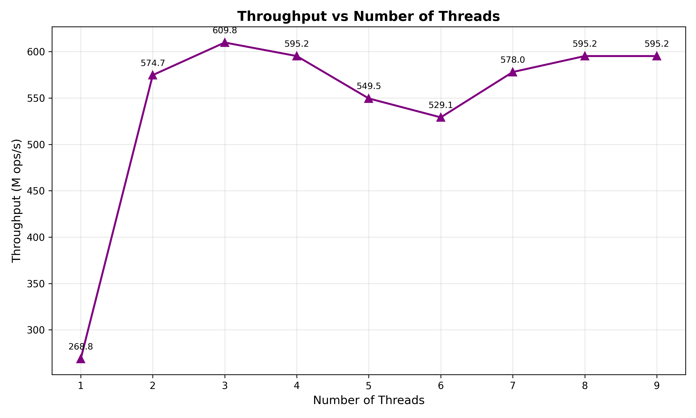

# Experiment 2 — Speedup, Parallel Efficiency & Throughput

## Objective
Evaluate the performance scaling of OpenMP vector addition by calculating speedup, parallel efficiency, and throughput using execution times from Experiment 1.

## Formulas Used

**Speedup:**
$$S(p) = \frac{T_1}{T_p}$$

**Parallel Efficiency:**
$$E(p) = \frac{S(p)}{p} \times 100\%$$

**Throughput:**
$$\text{Throughput} = \frac{N}{T_p} \text{ (operations/second)}$$

Where:
- $T_1$ = execution time with 1 thread (0.372 seconds)
- $T_p$ = execution time with p threads
- $N$ = 100,000,000 elements

## Results

| Threads (p) | Time (s) | Speedup S(p) | Efficiency E(p) | Throughput (ops/s) |
|-------------|----------|--------------|-----------------|-------------------|
| 1           | 0.372    | 1.00         | 100.00%         | 268.8 M           |
| 2           | 0.174    | 2.14         | 107.00%         | 574.7 M           |
| 3           | 0.164    | 2.27         | 75.67%          | 609.8 M           |
| 4           | 0.168    | 2.21         | 55.25%          | 595.2 M           |
| 5           | 0.182    | 2.04         | 40.80%          | 549.5 M           |
| 6           | 0.189    | 1.97         | 32.83%          | 529.1 M           |
| 7           | 0.173    | 2.15         | 30.71%          | 578.0 M           |
| 8           | 0.168    | 2.21         | 27.63%          | 595.2 M           |
| 9           | 0.168    | 2.21         | 24.56%          | 595.2 M           |

## Analysis

### Speedup
- **Peak Speedup**: 2.27x at 3 threads
- **Super-linear at 2 threads**: 2.14x speedup (107% efficiency) likely due to improved cache utilization
- **Speedup plateaus** after 3 threads, indicating memory bandwidth saturation

### Parallel Efficiency
- **Best Efficiency**: 107% at 2 threads (super-linear)
- **Rapid decline** from 75.67% (3 threads) to 24.56% (9 threads)
- Efficiency drops below 50% after 4 threads, showing poor scalability

### Throughput
- **Maximum**: 609.8 million operations/second at 3 threads
- **2.27x improvement** over single-threaded performance
- Throughput stabilizes around 595 M ops/s for 4, 8, and 9 threads

## Key Insights
1. **Memory-Bound Operation**: Vector addition is limited by memory bandwidth, not computation
2. **Optimal Configuration**: 2-3 threads provide the best balance of speedup and efficiency
3. **Diminishing Returns**: Adding more threads beyond 4 provides minimal benefit
4. **Thread Overhead**: More threads increase synchronization and cache coherency costs
5. **Super-linear Speedup**: Observed at 2 threads due to better cache locality

## Visualizations

### Combined Performance Analysis


### Individual Metrics




Run `plot_ques2.py` to generate all performance graphs:
```bash
python plot_ques2.py
```

## Compilation
```bash
gcc -fopenmp ques_2.c -o ques_2
```