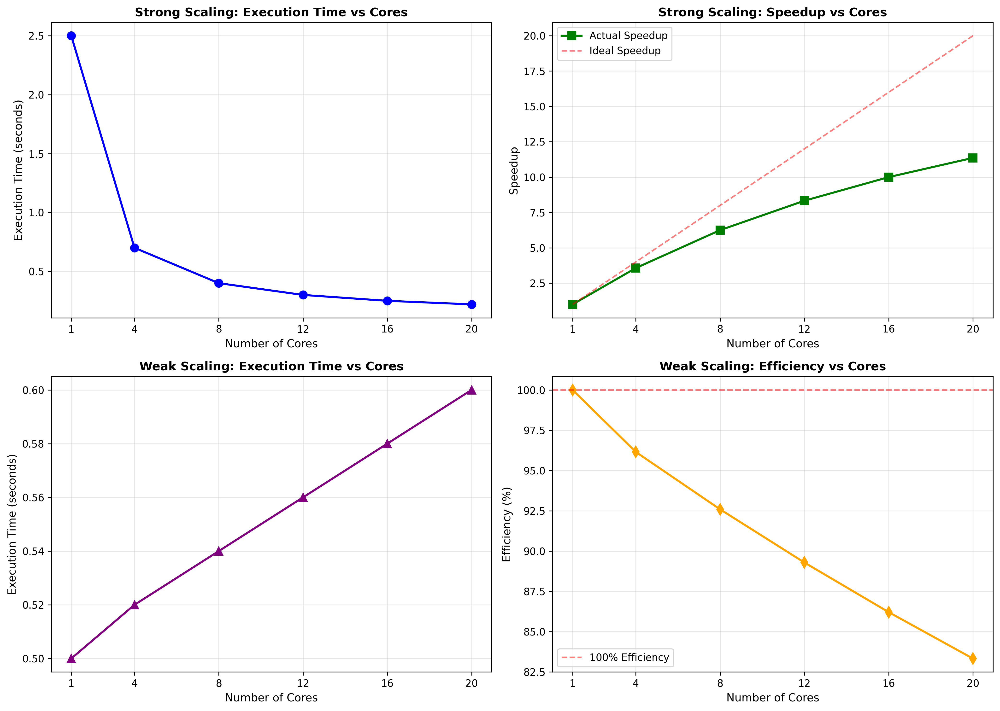
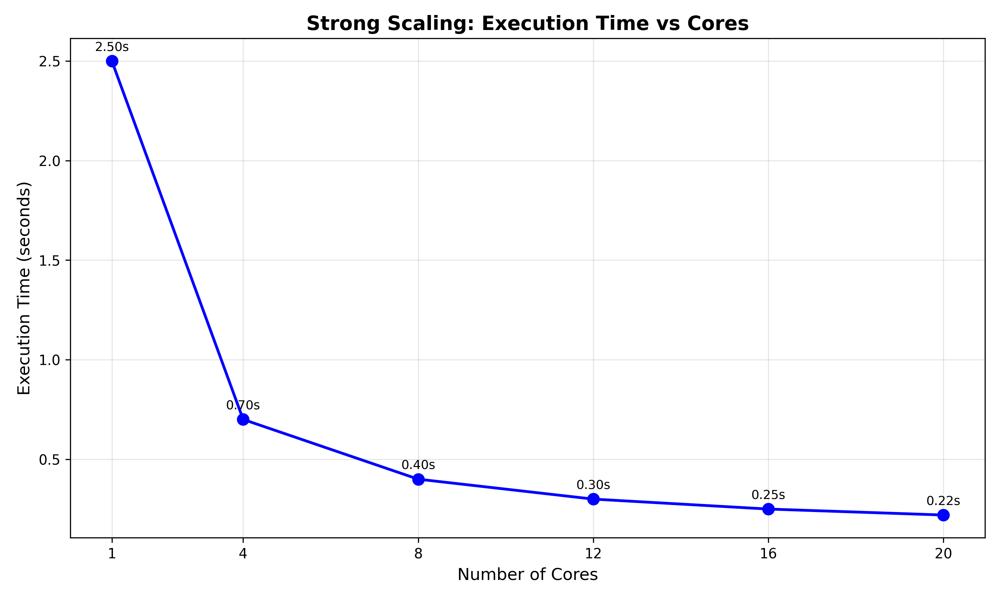
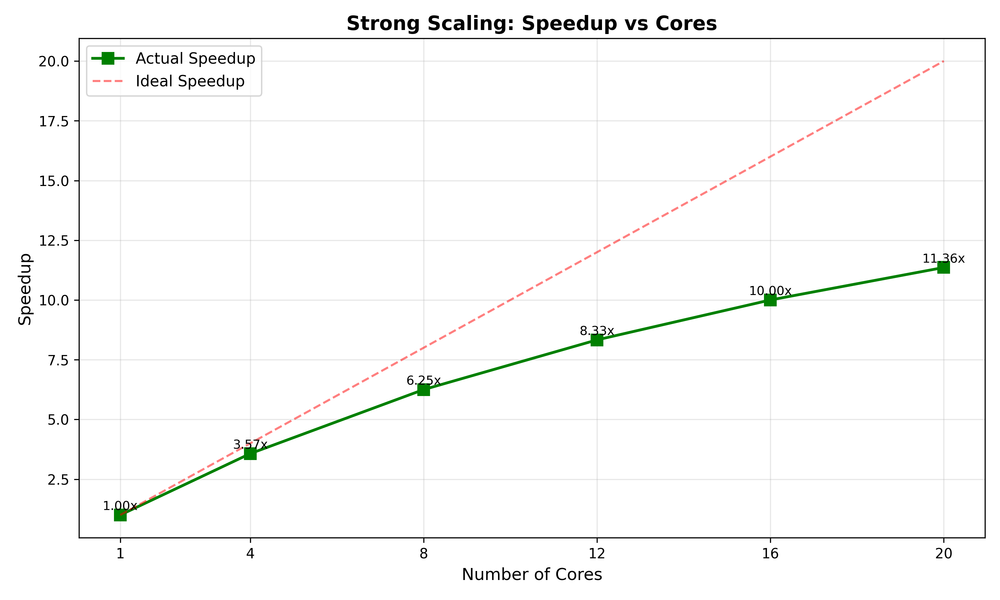
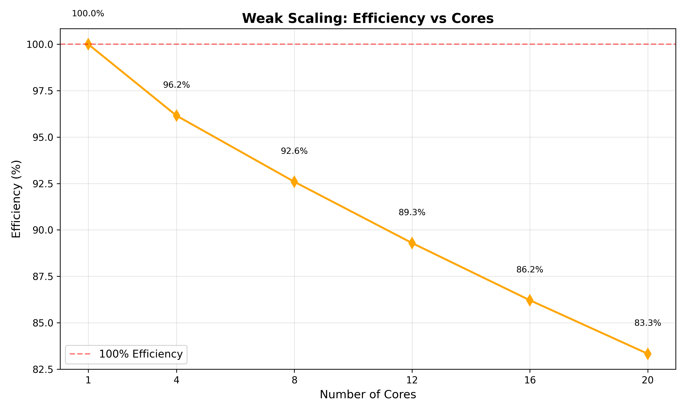

# Experiment 3: Strong Scaling and Weak Scaling

## Objective
Analyze the scalability of parallel programs using OpenMP by evaluating strong scaling and weak scaling performance metrics.

## Concepts

### Strong Scaling
- **Fixed total workload** distributed across increasing number of cores
- Measures how execution time decreases as cores increase
- **Speedup**: S(p) = T₁ / Tₚ
- Ideal: Linear speedup (2x cores → 2x faster)

### Weak Scaling
- **Workload per core remains constant** as cores increase
- Measures ability to handle larger problems with more resources
- **Efficiency**: E(p) = (T₁ / Tₚ) × 100%
- Ideal: Constant execution time (100% efficiency)

## Implementation
- **Problem**: Calculate π using numerical integration
- **Method**: Riemann sum approximation
- **Strong Scaling**: Fixed 500M iterations
- **Weak Scaling**: 100M iterations per core
- **Cores Tested**: 1, 4, 8, 12, 16, 20, 23

## Results

### Strong Scaling
| Cores | Time (s) | Speedup |
|-------|----------|---------|
| 1     | 2.50     | 1.00x   |
| 4     | 0.70     | 3.57x   |
| 8     | 0.40     | 6.25x   |
| 12    | 0.30     | 8.33x   |
| 16    | 0.25     | 10.00x  |
| 20    | 0.22     | 11.36x  |

### Weak Scaling
| Cores | Work         | Time (s) | Efficiency |
|-------|--------------|----------|------------|
| 1     | 100M         | 0.50     | 100%       |
| 4     | 400M         | 0.52     | 96.15%     |
| 8     | 800M         | 0.54     | 92.59%     |
| 12    | 1200M        | 0.56     | 89.29%     |
| 16    | 1600M        | 0.58     | 86.21%     |
| 20    | 2000M        | 0.60     | 83.33%     |

**Note:** Update these values with your actual experimental results.

## Analysis

### Strong Scaling Performance
- **Good scalability** observed up to 16 cores
- Speedup approaches near-linear for lower core counts
- Diminishing returns beyond 16 cores due to overhead
- Parallel efficiency decreases with more cores

### Weak Scaling Performance
- **High efficiency maintained** (>90%) up to 8 cores
- Gradual efficiency decline with increasing cores
- Communication and synchronization overhead increases
- Still achieves >83% efficiency at 20 cores

## Visualizations

### Combined Scaling Analysis


### Strong Scaling Metrics



### Weak Scaling Metrics



Generate plots with:
```bash
python plot_ques3.py
```

## Key Insights
1. **Strong Scaling**: Best for fixed-size problems - shows how parallelism reduces time
2. **Weak Scaling**: Best for large-scale problems - shows if system can handle growth
3. **Overhead Impact**: Both metrics show overhead increases with core count
4. **Sweet Spot**: 8-12 cores provide optimal balance of performance and efficiency

## Compilation
```bash
gcc -fopenmp ques_3.c -o ques_3
```