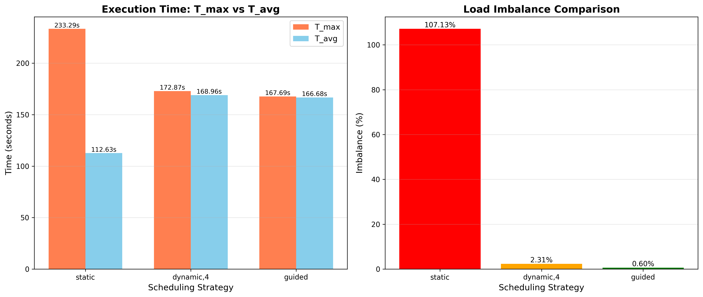
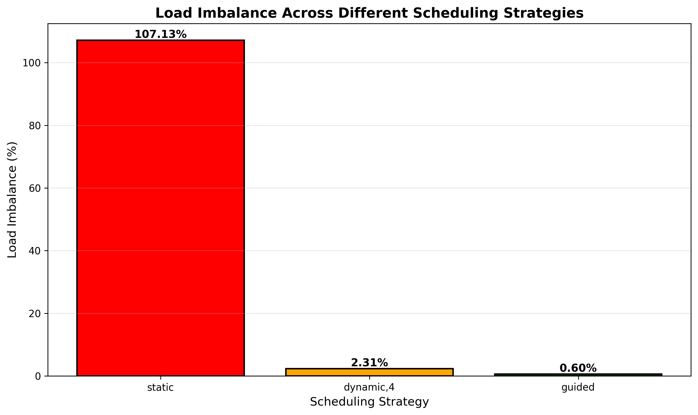
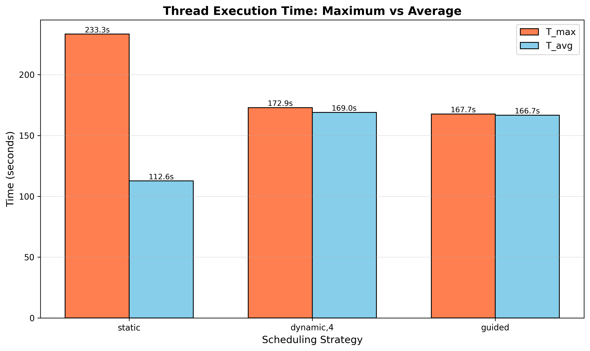

# Experiment 4: Scheduling and Load Imbalance in OpenMP

## Objective
Analyze and compare different OpenMP loop scheduling strategies to understand their impact on load balancing and performance in parallel computing.

## Scheduling Strategies

### 1. Static Scheduling
- **Behavior**: Divides iterations into equal-sized chunks assigned to threads at compile time
- **Use Case**: Best for uniform workloads where each iteration takes similar time
- **Pros**: Low overhead, predictable
- **Cons**: Poor performance with imbalanced workloads

### 2. Dynamic Scheduling (chunk=4)
- **Behavior**: Assigns small chunks (size 4) to threads at runtime as they become available
- **Use Case**: Good for moderately imbalanced workloads
- **Pros**: Better load balancing than static
- **Cons**: Higher overhead due to runtime scheduling

### 3. Guided Scheduling
- **Behavior**: Starts with large chunks and progressively reduces chunk size
- **Use Case**: Optimal for highly imbalanced workloads
- **Pros**: Balances performance and overhead
- **Cons**: Slightly more complex scheduling logic

## Implementation
- **Workload**: Progressive computation - iteration i requires (i+1)×50,000 operations
- **Total Iterations**: 1,000
- **Operation**: sin(j) × cos(j) calculations
- **Measurement**: Per-thread execution time with `nowait` clause

## Results

| Schedule   | T_max (s) | T_avg (s) | Imbalance (%) |
|------------|-----------|-----------|---------------|
| static     | 233.29    | 112.63    | 107.13%       |
| dynamic,4  | 172.87    | 168.96    | 2.31%         |
| guided     | 167.69    | 166.68    | 0.60%         |

## Analysis

### Load Imbalance Formula
$$\text{Imbalance} = \frac{T_{max} - T_{avg}}{T_{avg}} \times 100\%$$

Where:
- $T_{max}$ = Maximum time taken by any thread
- $T_{avg}$ = Average time across all threads

### Performance Observations

**Static Scheduling:**
- Extremely high imbalance (107%)
- T_max (233s) is more than **double** T_avg (113s)
- Early threads finish quickly while late threads are severely overloaded
- Worst case: one thread gets iterations 0-124, another gets 875-999 (vastly different workloads)
- Total execution time dominated by the slowest thread

**Dynamic Scheduling:**
- Dramatically reduced imbalance to 2.31%
- T_max and T_avg are very close (173s vs 169s)
- Runtime chunk distribution (size 4) enables threads to self-balance
- **26% faster** than static (233s → 173s)
- Small overhead from dynamic scheduling is negligible compared to gains

**Guided Scheduling:**
- Best performance: only 0.60% imbalance
- Nearly perfect load balance (T_max ≈ T_avg)
- **28% faster** than static, **3% faster** than dynamic
- Adaptive chunking optimally handles progressive workload increase
- Large initial chunks reduce overhead, small final chunks ensure balance

## Key Insights

1. **Workload Matters**: Static is terrible for imbalanced workloads but has lowest overhead
2. **Dynamic Adapts**: Runtime scheduling can significantly reduce imbalance
3. **Guided Wins**: For progressively heavier workloads, guided provides optimal balance
4. **Overhead Trade-off**: Better load balancing comes at cost of scheduling overhead
5. **Chunk Size Impact**: Dynamic chunk size (4) affects granularity of load distribution

## Visualizations

### Scheduling Comparison


### Load Imbalance


### Thread Distribution


Generate plots with:
```bash
python plot_ques4.py
```

## Compilation
```bash
gcc -fopenmp ques_4.c -o ques_4 -lm
```

## Conclusion
For workloads with variable iteration costs, **guided scheduling** provides the best load balancing with acceptable overhead. Static scheduling should only be used when all iterations have similar execution times.
